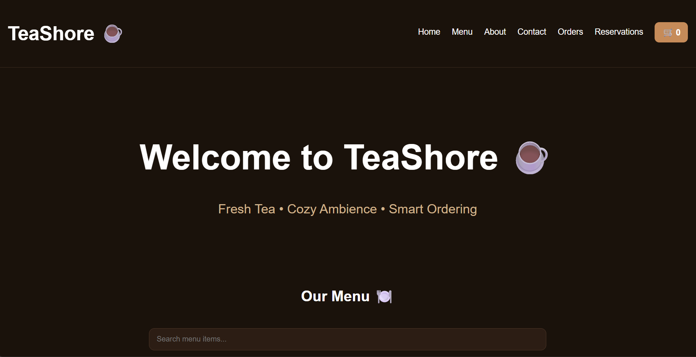
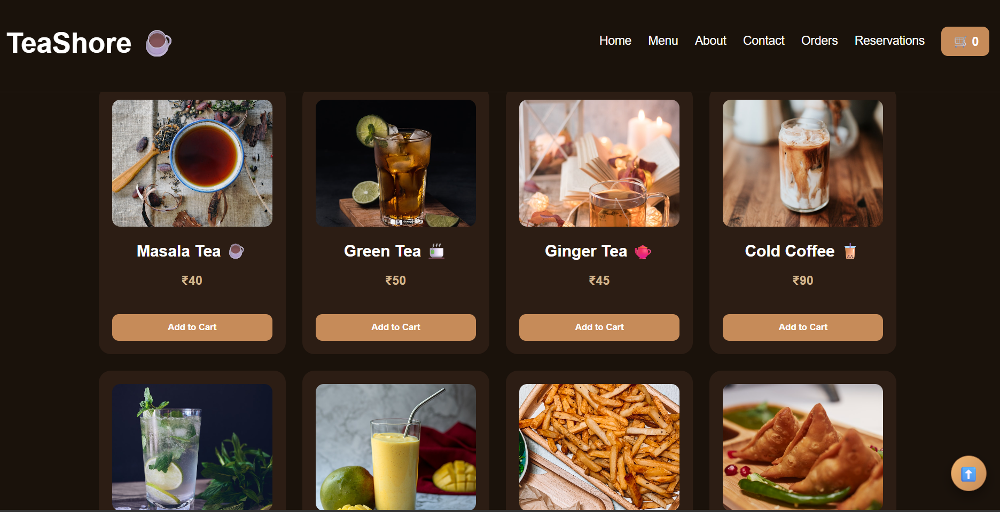
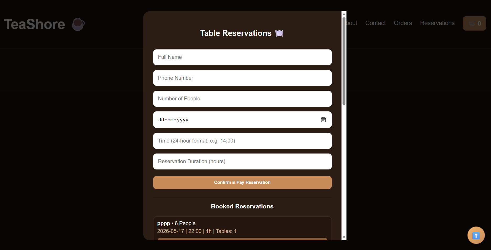
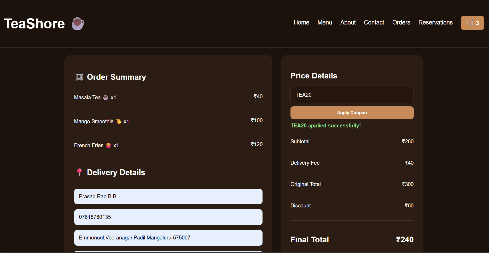
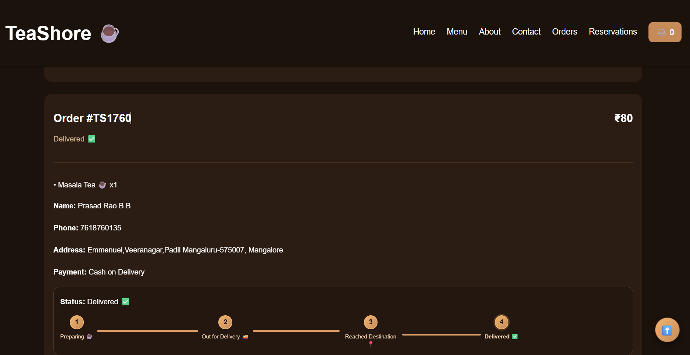
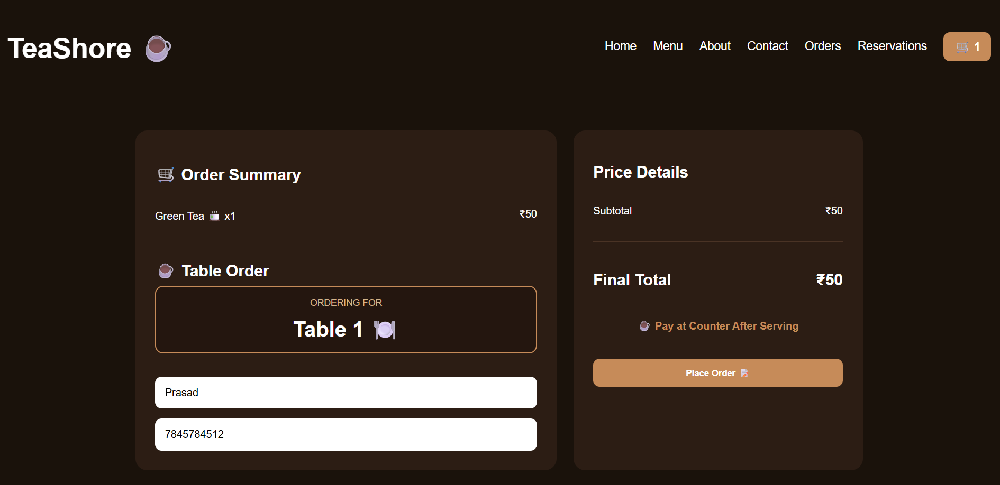

# 🫖 TeaShore

## AI-Powered Smart Cafe Experience Platform with QR-Based In-Shop Ordering & Online Takeaway

TeaShore is a Full Stack MERN web application developed to provide a smart digital cafe experience. The platform allows customers to browse menu items, reserve tables, place takeaway orders, order directly from their tables using QR codes, and track their orders in real time.


---

# 📸 Project Screenshots

## 🏠 Home Page

<p align="center">

</p>

---

## 🍵 Menu Page

<p align="center">

</p>

---

## 📅 Table Reservation

<p align="center">

</p>

---

## 🧾 Order Summary

<p align="center">

</p>

---

## 🚚 Order Tracking

<p align="center">

</p>

---

## 🍽 Indoor Table Interface

<p align="center">

</p>


# 📌 About the Project

TeaShore simplifies cafe management by combining multiple services into one application.

The application allows customers to:

- Browse food and beverages
- Search menu items
- Reserve tables online
- Order food using QR codes
- View order summary
- Track order status
- Enjoy a responsive and user-friendly interface

---

# ✨ Features

- 🏠 Responsive Home Page
- 🍵 Browse Menu
- 🔍 Search Menu Items
- 📅 Table Reservation
- 🍽 QR-Based Table Ordering
- 🧾 Order Summary
- 🚚 Order Tracking
- 🔐 User Authentication
- 📱 Responsive Design

---

# 🛠 Tech Stack

## Frontend

- React.js
- HTML5
- CSS3
- JavaScript

## Backend

- Node.js
- Express.js

## Database

- MongoDB
- Mongoose

## Tools

- VS Code
- Git
- GitHub


# 🚀 Installation

## Clone Repository

```bash
git clone https://github.com/PrasadBBRao/TeaShore.git
```

## Backend

```bash
cd backend
npm install
npm start
```

## Frontend

```bash
cd frontend
npm install
npm run dev
```

---

# 🔄 Workflow

1. Open TeaShore
2. Browse Menu
3. Search Food Items
4. Reserve Table (Optional)
5. Scan QR Code
6. Add Items to Cart
7. View Order Summary
8. Place Order
9. Track Order Status

---

# 📂 Project Structure

```
TeaShore
│
├── backend
│   ├── controllers
│   ├── models
│   ├── routes
│   ├── middleware
│   └── server.js
│
├── frontend
│   ├── public
│   ├── src
│   │   ├── components
│   │   ├── pages
│   │   ├── assets
│   │   └── App.jsx
│
├── images
│
└── README.md
```

---

# 🚀 Future Enhancements

- 🤖 AI Food Recommendation
- 💳 Online Payment Gateway
- 📊 Admin Analytics Dashboard
- 🔔 Push Notifications
- ⭐ Customer Reviews
- 🍽 Multi-Branch Support

---

# 👨‍💻 Author

**Prasad Rao B B**

B.E. Information Science & Engineering


GitHub:

https://github.com/PrasadBBRao

---

## ⭐ If you like this project, don't forget to Star the repository.
